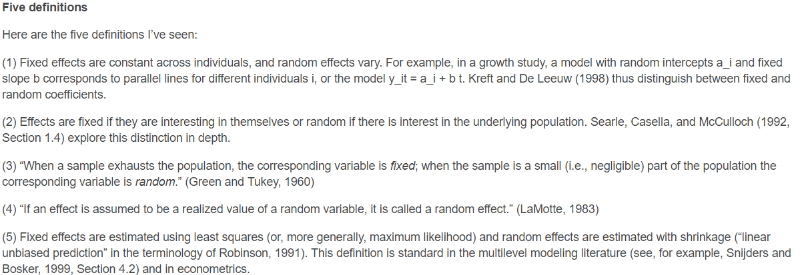

```{r setup, include = FALSE}
options(htmltools.dir.version = FALSE)
library(tidyverse)
library(lme4)
library(ggforce)
library(DiagrammeR)
```

# Independent identically distributed errors

.pull-left[
```{r echo = FALSE, fig.height = 5, fig.width = 6}
a <- rnorm(300)
X1 <- rnorm(300)
X2 <- rnorm(300)
Y <- a + X1 * 0.5 + X2 * 0.2 + rnorm(300)
test_model <- lm(Y ~ X1 + X2)
qplot(fitted(test_model),
      scale(resid(test_model))) + 
  xlab("Fitted values") + 
  ylab("Standardized residuals") + 
  theme_bw() +
  theme(text = element_text(size = 18)) +
  geom_hline(yintercept = 0) 
  
```
]

.pull-right[
One of the key assumptions of many of the tests we've covered is that of **independent identically distributed** (*iid*) errors.

All of the points on this graph are from *independent sources*.
]


---
# Clustered data

.pull-left[
```{r echo = FALSE, fig.height = 6}
test_resd <- data.frame(fits = fitted(test_model),
                        resids = resid(test_model))
test_resd$participant <- cut(test_resd$fits,
                             5,
                             labels = 1:5)
ggplot(test_resd, 
       aes(x = fits, 
           y = resids)) +
  xlab("Fitted values") + 
  ylab("Standardized residuals") + 
  theme_bw() + 
  theme(text = element_text(size = 18)) +
  geom_hline(yintercept = 0) +
  geom_point(aes(colour = participant),
             size = 3,
             alpha = 0.7) 
```
]
.pull-right[
But real data often has *clusters* of correlated observations.
]

---
# Correlated data

.pull-left[
```{r echo = FALSE, fig.height = 6}
test_resd <- data.frame(fits = fitted(test_model),
                        resids = resid(test_model))
test_resd$participant <- cut(test_resd$fits,
                             5,
                             labels = 1:5)
ggplot(test_resd, 
       aes(x = fits, 
           y = resids)) +
  xlab("Fitted values") + 
  ylab("Standardized residuals") + 
  theme_bw() + 
  theme(text = element_text(size = 18)) +
  geom_hline(yintercept = 0) +
  geom_mark_rect(aes(fill = participant),
                 alpha = 0.5) +
  geom_point(aes(colour = participant),
             size = 3,
             alpha = 0.7) 
```
]
.pull-right[
But real data often has *clusters* of correlated observations.

For example, multiple datapoints can originate from the same participants.
]

---
# Multilevel data

There are *many* situations in psychology where we have *nested* data.

e.g. Typical cognitive experiments show participants many repeats of similar trials.

Intervention students are typically longitudinal - the same participants are tested multiple times on the same outcome measure.

---
# Multilevel data

```{r echo = FALSE, fig.height = 6}
a_graph <- 
  create_graph() %>%
  add_node(type = "school",
           label = "School") %>%
  add_node(type = "pupil",
           label = "pupil",
           from = 1) %>%
  add_node(type = "pupil",
           label = "pupil",
           from = 1) %>%
  add_node(type = "pupil",
           label = "pupil",
           from = 1) %>%
  add_node(type = "school",
           label = "School") %>%
  add_node(type = "pupil",
           label = "pupil",
           from = 5) %>%
  add_node(type = "pupil",
           label = "pupil",
           from = 5) %>%
  add_node(type = "pupil",
           label = "pupil",
           from = 5) %>%
  add_node(type = "school",
           label = "School") %>%
  add_node(type = "pupil",
           label = "pupil",
           from = 9) %>%
  add_node(type = "pupil",
           label = "pupil",
           from = 9) %>%
  add_node(type = "pupil",
           label = "pupil",
           from = 9)
render_graph(a_graph,
             layout = "tree",
             width = 850,
             height = 200)
```

Each pupil is an observation. Pupils who attend the same school tend to be more similar to each other than to pupils who attend other schools.

*Pupils* (Level 1) are nested in *schools* (Level 2).

---
class: center, middle, inverse
# Estimating multilevel models

---
# Multilevel models

Multilevel models allow us to account for the nested, correlated nature of the data.

You may also see them called:
- Hierarchical models
- Mixed-effects models
- Random-effects models
- Mixed models

---
# Fixed and random effects


https://statmodeling.stat.columbia.edu/2005/01/25/why_i_dont_use/

---
# Fixed and random effects

A simpler way to think of it: 

Fixed effects are the average effect; the population-average.

Random effects are those that vary across the *sampling units*. 

e.g. a subject in an experiment is a random draw from a population.


---
# sleepstudy

The *sleepstudy* dataset contains data from a sleep deprivation experiment. 

Over the course of ten days, subjects were only allowed to sleep for 3 hours each night. 

Each day their reaction times on a variety of cognitive tasks were recorded.

This is a *nested*, multilevel design.

Each observation - average RT on a given day - is nested within a *subject*.

---
# sleepstudy
```{r echo = FALSE}
DT::datatable(sleepstudy, options = list(pageLength = 5))
```

---
# sleepstudy

.pull-left[
```{r echo = FALSE, fig.height = 6}
ggplot(sleepstudy,
       aes(x = Days,
           y = Reaction)) + 
  geom_point() + 
  theme_bw() +
  theme(text = element_text(size = 18)) +
  xlab("Days of sleep deprivation") +
  ylab("Reaction time (ms)") +
  stat_smooth(method = "lm")
```
]
.pull-right[
Suppose we were to ignore the clustering in the data.

We could simply fit a linear model to the whole dataset.
]

---
# A basic linear model

```{r}
basic_lm <- lm(Reaction ~ Days, data = sleepstudy)
summary(basic_lm)
```


---
# A quick look at the residuals
.pull-left[
```{r fig.height = 5}
plot(basic_lm, which = 1)
```
]
.pull-right[
For each one unit increase in Days, predicted RTs go up by around 10 ms. 

These residuals aren't terrible, but show a degree of patterning that suggests something is not being accounted for in our model.
]

---
# sleepstudy

.pull-left[
There are 18 participants in this study. Some of them are generally faster or slower than others; some of them show more effect of sleep deprivation than others.

```{r indiv-sleep, fig.height = 6, fig.show = "hide"}
ggplot(sleepstudy,
       aes(x = Days,
           y = Reaction)) + 
  geom_point() + 
  theme_bw() +
  theme(text = element_text(size = 18)) +
  xlab("Days of sleep deprivation") +
  ylab("Reaction time (ms)") +
  facet_wrap(~Subject)
```
]
.pull-right[
`)
]

---
# sleepstudy

.pull-left[
```{r echo = FALSE, fig.height = 6}
ggplot(sleepstudy,
       aes(x = Days,
           y = Reaction)) + 
  geom_point(aes(colour = Subject), size = 2, alpha = 0.3) + 
  theme_bw() +
  theme(text = element_text(size = 18)) +
  xlab("Days of sleep deprivation") +
  ylab("Reaction time (ms)") +
  stat_smooth(method = "lm")
```
]
.pull-right[
Our simple linear model ignores the fact that many of our observations are repeated measurements from each participant.

We want to tease apart the *average*, *fixed* effect of days of sleep deprivation, and the varying, *random* contribution or *differences* of individual subjects from that average.
]

---
class: center, middle, inverse
# A multi-stage approach to multilevel data

---
# Individual models

.pull-left[
We could fit individual regression models for each participant.

An easy way to do that is with the **lmList()** function from the **lme4** package.
```{r}
indiv_mods <- 
  lmList(Reaction ~ Days | Subject,
         data = sleepstudy)
```
]
.pull-right[
```{r}
coef(indiv_mods)
```
]

---
# Individual intercepts

.pull-left[
```{r indiv-ints, echo = FALSE}
ggplot(sleepstudy,
       aes(x = Days,
           y = Reaction)) + 
  geom_point(aes(colour = Subject)) + 
  theme_bw() +
  theme(text = element_text(size = 18)) +
  xlab("Days of sleep deprivation") +
  ylab("Reaction time (ms)") +
  facet_wrap(~Subject) +
  stat_smooth(method = "lm",
              formula = y ~ 1,
              se = FALSE,
              aes(colour = Subject)) +
  geom_hline(yintercept = coef(basic_lm)[1] + 
               coef(basic_lm)[2] * 
               mean(sleepstudy$Days)) +
  scale_x_continuous(breaks = 0:9)
```
]
.pull-right[
Each participant has their own separate model with its own Intercept and own coefficients.

Here, the coloured lines represent the participants' *mean* RTs when Days is at its mean value, while the black lines represent the predictions of the linear model we fit to *all* the data.
]

---
# Individual models

.pull-left[
```{r indiv-regs, echo = FALSE}
ggplot(sleepstudy,
       aes(x = Days,
           y = Reaction)) + 
  geom_point() + 
  theme_bw() +
  theme(text = element_text(size = 18)) +
  xlab("Days of sleep deprivation") +
  ylab("Reaction time (ms)") +
  facet_wrap(~Subject) + 
  stat_smooth(method = "lm", se = FALSE) +
  geom_abline(slope = coef(basic_lm)[2],
              intercept = coef(basic_lm)[1])
```
]
.pull-right[
We now have separate models for the relationship between Days and RT for each participant. 

But it's clear that some participants have stronger effects than others.
]

---
# A two-stage approach

Once we have our individual models, we can test the model coefficients for the effect of interest against zero with a *t-test*.
.pull-left[
```{r}
coef(indiv_mods)["Days"]
```
]
.pull-right[
```{r}
t.test(coef(indiv_mods)["Days"])
```
]

---
# Two-stage approach

Our estimates from the original linear model...

```{r echo = FALSE}
coef(summary(basic_lm))[2, ]
```

...are similar to those from our t-test approach, but underestimate variability.

```{r echo = FALSE}
t.test(coef(indiv_mods)["Days"])
```

---
# A two-stage approach

This approach is common in neuroimaging.

fMRI analysis software such as FSL and SPM use this approach, as does EEG analysis software such as LimoEEG.

Models are estimated at the *first-level* (i.e. separately, for each subject), then the coefficients are carried forward to the *second-level*.

---
# Why not do this all the time?

Often this approach is *approximately* correct, as long as:

1) the data is balanced.

2) individual participant variances are equal.

BUT: 

If data is missing, or there are *multiple* possible *random effects*, this approach does not work so well!

---
class: inverse, middle, center
# Multilevel models with lme4

---
# Multilevel models using lme4

```{r eval = FALSE}
library(lme4)
```
lmer(DV ~ .blue[IV1 + IV2] + (.green[IV1]| .red[random_factor]), data = your_data)

.blue[Fixed] *effects* are highlighted in .blue[blue].

.red[Random] *effects* are highlighted in .red[red]. Random effects are always *categorical*.

.green[Random] *slopes* are highighted in .green[green].


---
# Individual models

.pull-left[
`)
]
.pull-right[
`)
]

---
# Modelling random intercepts

As mentioned, each subject has their own intercept. We can incorporate this into our model by including a *random effect* term - *(1 | Subject)*.

```{r}
int_only <- 
  lmer(Reaction ~ Days + (1 | Subject),
       data = sleepstudy) # Random intercept
```

---

```{r}
summary(int_only)
```

---
# Fixed and random effects

.pull-left[
The *fixed* effects give us a measure of average performance and the overall effect of Days of sleep deprivation on RT.
```{r}
fixef(int_only)
```
]
.pull-right[
The *random* effects tell us how much variability there is *between-participants*. In this case, we only estimated participant-specific intercepts.

```{r}
summary(int_only)$varcor
```
]

---
# Intercept only model

.pull-left[
```{r}
coef(int_only)
```
]
.pull-right[
```{r}
ranef(int_only)
```
]

---
#A quick look at the residuals

.pull-left[
```{r fig.height=6}
library(sjPlot)
plot_model(int_only, type = "diag")[[4]]
```
]
.pull-right[
This model - the *random intercept* model - shows evidence of heteroskedasticity - non-constant variance. 

This suggests there is still something not quite right in our model.
]


---
# Modelling random slopes

We can also model how much the effect of Days varies between participants by adding  *random slopes* to our model - (Days | Subject).
```{r}
random_slope <- lmer(Reaction ~ Days + (Days | Subject), 
                     data = sleepstudy)
summary(random_slope)$varcor
```

This model tells us how much the effect of *Days* varies between participants, and how strong the correlation is between the intercept and the slope.

---
# Random slopes model

.pull-left[
```{r}
coef(random_slope)
```
]
.pull-right[
```{r}
ranef(random_slope)
```
]

---
# Model comparisons

Is this model an improvement?

```{r}
anova(int_only, random_slope)
```

---
#A quick look at the residuals

```{r fig.height = 5}
plot_model(random_slope, type = "diag")[[4]]
```

---
# Correlated slopes and intercepts

Suppose you hypothesised that participants who were faster overall showed smaller effects of days of sleep deprivation. You would expect a negative correlation between the slopes and intercepts.
.center[
```{r echo = FALSE, fig.height = 5}
plot_model(random_slope,
           type = "re",
           sort.est = "(Intercept)") +
  theme_bw() +
  theme(text= element_text(size = 18))
```
]

---
# Model comparisons

The correlation between the slopes and intercepts is almost zero. Do we need it in the model?

```{r}
no_corrs <- lmer(Reaction ~ Days + (1|Subject) + (0 + Days|Subject),
                 data = sleepstudy)
```

.pull-left[
```{r}
summary(no_corrs)$varcor
```
]
.pull-right[
```{r}
summary(random_slope)$varcor
```
]

---
# Model comparisons

```{r}
anova(no_corrs, random_slope)
```

---

.pull-left[
## Intercept only
```{r}
fixef(int_only)
```
## Random slopes
```{r}
fixef(random_slope)
```
]
.pull-right[
## Intercept only
```{r}
summary(int_only)$varcor
```
## Random slopes
```{r}
summary(random_slope)$varcor
```
]

---

```{r}
summary(random_slope)
```

---

```{r message = FALSE, warning = FALSE, echo = FALSE}
tab_model(random_slope)
```

---
# Example model syntax

```{r eval = FALSE}
lmer(Reaction ~ Days + (1 | Subject),
     data = sleepstudy) # Random intercept
```

```{r eval = FALSE}
lmer(Reaction ~ Days + (1 + Days | Subject),
     data = sleepstudy) # Random slope
lmer(Reaction ~ Days + (Days | Subject),
     data = sleepstudy) # Random slope (same as the one above)
```

```{r eval = FALSE}
lmer(Reaction ~ Days + (1 | Subject) + (0 + Days | Subject),
     data = sleepstudy) # zero-covariance model
```

---
class: inverse, middle, center
# Partial pooling and shrinkage

---
# Pooling

The key difference between the **lmList()** and **lmer()** approaches is how they handle variance.

**lmList()** fits individual regression models and treats them as *independent*.

**lmer()** - the mixed model approach - models the regressions as draws from a *population*.

---
# Pooling

||Complete pooling | Partial pooling | No pooling|
|--|--|--|--|
|**Method**|Fitting a linear model to all data | Fitting a mixed-effects model | Fitting an lm() separately for each level of a grouping, random effect|
|**Function**|lm()|lmer()|lmList()|

---
# Shrinkage

.pull-left[
```{r echo = FALSE, fig.height = 6}
hej <- data.frame(individual = coef(indiv_mods)[, 2],
                  mixed = coef(random_slope)$Subject[, 2])
hej$Subject <- factor(1:18)
hej %>%
  gather(mod_t, slopes, -Subject) %>%
  ggplot(aes(x = mod_t, y = slopes)) +
  geom_violin() +
  geom_point(aes(colour = Subject)) +
  geom_line(aes(group = Subject, colour = Subject)) +
  theme_bw() +
  theme(text = element_text(size = 18)) + 
  xlab("") + 
  ylab("Slope of days")
```
]
.pull-right[
Values with extreme or *variable* estimates are drawn towards the mean of the distribution.

This is comparable to the phenomenon of *regression to the mean*.
]

---
# Effects of shrinkage and pooling

.pull-left[
```{r echo = FALSE, fig.width = 9}
rand_coefs <- coef(random_slope)$Subject
sub_nos <- c(308, 309, 310, 330, 331, 332,
             333, 334, 335, 337, 349, 350,
             351, 352, 369, 370, 371, 372)
rand_coefs$Subject <- sub_nos
no_pool_co <- coef(indiv_mods)
no_pool_co$Subject <- sub_nos
ggplot(sleepstudy,
       aes(x = Days,
           y = Reaction)) +
  geom_point( alpha = 0) + 
  facet_wrap(~Subject) +
  geom_abline(data = rand_coefs,
              aes(slope = Days,
                  intercept = `(Intercept)`),
              size = 1.5,
              alpha = 0.5,
              colour = "red") +
  geom_abline(slope = coef(basic_lm)[2], 
              intercept = coef(basic_lm)[1], 
              size = 1.5,
              alpha = 0.5) +
  geom_abline(data = no_pool_co,
              aes(slope = Days,
                  intercept = `(Intercept)`),
              colour = "blue",
              size = 1.5, 
              alpha = 0.5) + 
  theme_bw() +
  theme(text = element_text(size = 18)) +
  xlab("Days of sleep deprivation") +
  ylab("Reaction time (ms)")
```
]
.pull-right[
Black line - Complete pooling. 

Red line - Partial pooling. 

Blue line - No pooling.
]

---
class: middle, center, inverse
# Multiple random effects

---
# The "language as fixed-effect" fallacy

A common circumstance in psychological research is that we have more than one random effect.

For example, in language experiments, subject often need to read a many different words; these may be words from different categories, or vary in other ways.

These words themselves are random samples.

[Clark, 1973](https://www.sciencedirect.com/science/article/pii/S0022537173800143)

---
# Multiple random effects

```{r message = FALSE}
politeness <- read_csv("data/politeness_data.csv")
head(politeness)
```

---

```{r}
boxplot(frequency ~ subject, data = politeness)
```

---

```{r}
boxplot(frequency ~ scenario, data = politeness)
```

---
# Multiple random effects
```{r}
full_mod <- lmer(frequency ~ attitude + (1|subject) + (1|scenario), data = politeness)
summary(full_mod)$varcor
```

---

```{r echo = FALSE}
summary(full_mod)
```

---
# Principles for specifying random effects structures

1) Every sampling unit gets a random intercept 
  - Random *effects* are always *categorical*, *grouping* variables.

2) Random slopes can (and usually should) be included whenever 
  - there are multiple observations of a given predictor within each *grouping* variable

3) Any interaction between fixed effects should also be included as a random slope.

---
# Convergence failures

Mixed models can become very computationally complex. 

You will sometimes get scary looking error messages, like:

1) boundary (singular) fit: see ?isSingular

2) unable to evaluate scaled gradient

3) Model failed to converge with max|grad| = 1.52673 (tol = 0.001, component 17)

---
# Convergence failures

Try increasing the number of iterations - control = lmerControl(optCtrl = list(maxfun = 20000))

```{r eval = FALSE}
lmer(Reaction ~ Days + (Days|Subject),
     data = sleepstudy,
     control = lmerControl(optCrl = list(maxfun = 1e5)))
```


---
# Convergence failures

Try rescaling your predictors using the **scale()** function.

```{r}
sleepstudy$scaled_days <- scale(sleepstudy$Days)
lmer(Reaction ~ scaled_days + (scaled_days|Subject),
     data = sleepstudy)
```

---
# Convergence failures

Sometimes you can fix it by changing the *contrasts*.

```{r}
options(contrasts = c("contr.sum", "contr.poly"))
```

Sometimes you can fix it by simplifying the model.

1) Fit a model with no correlations/covariances

2) Remove random slopes

---
# Convergence failures

But sometimes...

--

... you need MORE DATA!!!

---
# Generalized linear mixed effects models

As discussed last week, there are many types of data for which a linear model is *inappriate*. 

Fortunately, we can fit **generalized linear mixed effects models** too!

glmer(DV ~ IV1 + IV2 + (IV1 | random_factor), family = binomial(), data = your_data)

---
# Additional reading

[Complete vs Partial vs no pooling](https://www.tjmahr.com/plotting-partial-pooling-in-mixed-effects-models/)

[An introduction to mixed models](https://gkhajduk.github.io/2017-03-09-mixed-models/)

[Keep it Maximal](https://www.ncbi.nlm.nih.gov/pmc/articles/PMC3881361/)

[Generalizing over encounters: statistical and theoretical considerations](https://psyarxiv.com/mcrzu/)

---
class: title-slide-final, middle, inverse
background-image: url('images/University of Lincoln_logo_General White Landscape.png')
background-size: 500px
background-position: 50% 10%
