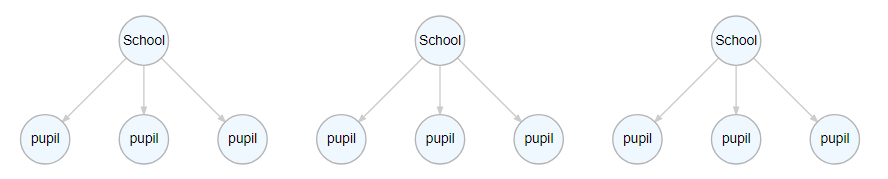
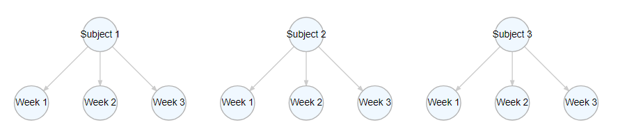

```{r setup, include = FALSE, message = FALSE, warning = FALSE}
options(htmltools.dir.version = FALSE)
library(tidyverse)
library(lme4)
library(ggforce)
library(sjPlot)
library(DiagrammeR)
library(car)
library(countdown)
data(sleepstudy)
```

# Multilevel data

There are *many* situations in psychology where we have *nested* data.

Intervention studies are typically longitudinal - the same participants are tested multiple times on the same outcome measure.

Typical cognitive experiments show participants many repeats of similar trials.


---
# Multilevel data

```{r schools, echo = FALSE, fig.height = 6}
a_graph <- 
  create_graph() %>%
  add_node(type = "school",
           label = "School") %>%
  add_node(type = "pupil",
           label = "pupil",
           from = 1) %>%
  add_node(type = "pupil",
           label = "pupil",
           from = 1) %>%
  add_node(type = "pupil",
           label = "pupil",
           from = 1) %>%
  add_node(type = "school",
           label = "School") %>%
  add_node(type = "pupil",
           label = "pupil",
           from = 5) %>%
  add_node(type = "pupil",
           label = "pupil",
           from = 5) %>%
  add_node(type = "pupil",
           label = "pupil",
           from = 5) %>%
  add_node(type = "school",
           label = "School") %>%
  add_node(type = "pupil",
           label = "pupil",
           from = 9) %>%
  add_node(type = "pupil",
           label = "pupil",
           from = 9) %>%
  add_node(type = "pupil",
           label = "pupil",
           from = 9)
# render_graph(a_graph,
#              layout = "tree",
#              width = 850,
#              height = 200)
```


In this example, each pupil is a unit of observation. 

But these pupils are not fully independent from each other - pupils who attend one school tend to be more similar to each other than they are to pupils who attend other schools.

Thus, *pupils* (Level 1) are nested in *schools* (Level 2).

---
# Multilevel data

```{r weeks, echo = FALSE}
b_graph <- 
  create_graph() %>%
  add_node(type = "subject",
           label = "Subject 1") %>%
  add_node(type = "week",
           label = "Week 1",
           from = 1) %>%
  add_node(type = "week",
           label = "Week 2",
           from = 1) %>%
  add_node(type = "week",
           label = "Week 3",
           from = 1) %>%
  add_node(type = "subject",
           label = "Subject 2") %>%
  add_node(type = "week",
           label = "Week 1",
           from = 5) %>%
  add_node(type = "week",
           label = "Week 2",
           from = 5) %>%
  add_node(type = "week",
           label = "Week 3",
           from = 5) %>%
  add_node(type = "subject",
           label = "Subject 3") %>%
  add_node(type = "week",
           label = "Week 1",
           from = 9) %>%
  add_node(type = "week",
           label = "Week 2",
           from = 9) %>%
  add_node(type = "week",
           label = "Week 3",
           from = 9)
# render_graph(b_graph,
#              layout = "tree",
#              width = 850,
#              height = 200)
```



Other data may be *longitudinal*. For example, you may measure outcomes such as, for example, performance or attitudes on repeated occassions to see how they vary over time.

The measurements each week are the main unit of observation, but they are nested within subjects.

---
# Independent identically distributed errors

.pull-left[
```{r echo = FALSE, fig.height = 5, fig.width = 6}
a <- rnorm(300)
X1 <- rnorm(300)
X2 <- rnorm(300)
Y <- a + X1 * 0.5 + X2 * 0.2 + rnorm(300)
test_model <- lm(Y ~ X1 + X2)
qplot(fitted(test_model),
      scale(resid(test_model))) + 
  xlab("Fitted values") + 
  ylab("Standardized residuals") + 
  theme_bw() +
  theme(text = element_text(size = 18)) +
  geom_hline(yintercept = 0) 
  
```
]

.pull-right[
One of the key assumptions of many of the tests we've covered is that of **independent identically distributed** (*iid*) errors.

All of the points on this graph are from *independent sources*: each point is a score from one person, on one measure, at one point in time.
]

---
# Clustered data

.pull-left[
```{r non-clust, echo = FALSE, fig.height = 6}
test_resd <- data.frame(fits = fitted(test_model),
                        resids = resid(test_model))
test_resd$Subject <- cut(test_resd$fits,
                             5,
                             labels = 1:5)
ggplot(test_resd, 
       aes(x = fits, 
           y = resids)) +
  xlab("Fitted values") + 
  ylab("Standardized residuals") + 
  theme_bw() + 
  theme(text = element_text(size = 18)) +
  geom_hline(yintercept = 0) +
  geom_point(aes(colour = Subject),
             size = 3,
             alpha = 0.7) 
```
]
.pull-right[
Data from nested designs like those we have just seen often have *clusters* of correlated observations.

Different people have different reaction speeds, or baseline attitudes; different schools have different teachers and different general environments.
]

---
# Clustered data

.pull-left[
```{r corr-subj, echo = FALSE, fig.height = 6}
test_resd <- data.frame(fits = fitted(test_model),
                        resids = resid(test_model))
test_resd$Subject <- cut(test_resd$fits,
                             5,
                             labels = 1:5)
ggplot(test_resd, 
       aes(x = fits, 
           y = resids)) +
  xlab("Fitted values") + 
  ylab("Standardized residuals") + 
  theme_bw() + 
  theme(text = element_text(size = 18)) +
  geom_hline(yintercept = 0) +
  geom_mark_rect(aes(fill = Subject),
                 alpha = 0.5) +
  geom_point(aes(colour = Subject),
             size = 3,
             alpha = 0.7) 
```
]
.pull-right[
Data from nested designs like those we have just seen often have *clusters* of correlated observations.

Different people have different reaction speeds, or baseline attitudes; different schools have different teachers and different general environments.
]

---
class: center, middle, inverse
# The problem with nesting

---
# sleepstudy

The *sleepstudy* dataset contains data from a sleep deprivation experiment. 

Over the course of ten days, subjects were only allowed to sleep for 3 hours each night. 

Each day their reaction times on a variety of cognitive tasks were recorded.

This is a *nested*, multilevel design.

Each observation - average RT on a given day - is nested within a *subject*.

---
# sleepstudy

.pull-left[
```{r echo = FALSE, fig.height = 6, message = FALSE}
ggplot(sleepstudy,
       aes(x = Days,
           y = Reaction)) + 
  geom_point() + 
  theme_bw() +
  theme(text = element_text(size = 18)) +
  xlab("Days of sleep deprivation") +
  ylab("Reaction time (ms)") +
  stat_smooth(method = "lm")
```
]
.pull-right[
Suppose we were to ignore the clustering in the data.

We could simply fit a linear model to the whole dataset.
]

---
# A basic linear model

```{r}
basic_lm <- lm(Reaction ~ Days, data = sleepstudy)
summary(basic_lm)
```

---
# A basic linear model

```{r}
coef(basic_lm)
```

The mean reaction time is 251 ms.

For each one unit increase in Days (i.e. for each extra day with disrupted sleep), predicted reaction times go up by around 10 ms. 

---
# A quick look at the residuals
.pull-left[
```{r fig.height = 5}
plot_model(basic_lm, type = "diag")[[1]]
```
]
.pull-right[

These residuals show a degree of patterning that suggests something is not being accounted for in our model.

The points clearly do not lie along the line, and seem to be more variable at the ends than over the full range of the x-axis.

]

---
# sleepstudy

.pull-left[
```{r echo = FALSE, fig.height = 6, message = FALSE}
ggplot(sleepstudy,
       aes(x = Days,
           y = Reaction,
           colour = Subject)) + 
  geom_point(aes(colour = Subject), size = 2, alpha = 0.3) + 
  theme_bw() +
  theme(text = element_text(size = 18)) +
  xlab("Days of sleep deprivation") +
  ylab("Reaction time (ms)") +
  stat_smooth(method = "lm", se = FALSE)
```
]
.pull-right[
Our simple linear model ignores the fact that many of our observations are repeated measurements from each participant.

It assumes the effect is the same for everyone.

There are 18 participants in this study. Some of them are generally faster or slower than others; some of them show more effect of sleep deprivation than others.
]

---
class: inverse, middle, center
# Estimating multilevel models 

---
# Nesting in `sleepstudy`

In the `sleepstudy` data, each subject is tested on 10 consecutive days. 

Thus, each subject contributes 10 reaction times. 

*Reaction times* (level 1) are nested within *subjects* (level 2).

Our basic linear model ignores the nesting and fits a single model to all the data.

This is fine for telling us the *group-average* but doesn't tell us about the variability between subjects.

---
# Multilevel models

Multilevel models allow us to account for the nested, correlated nature of the data, and explicitly model the variability between people.

You may also see them called:
- Hierarchical models
- Mixed-effects models
- Random-effects models
- Mixed models

---
# Fixed and random effects

.large[  
*Fixed effects* are the *population-average* effect: e.g. the *average* effect of days of sleep deprivation.

*Random effects* are those that vary across the *sampling units*. 

They are *random* because the *sampling units* are randomly drawn from a wider *population*. e.g. the specific participants in an experiment are usually a random subset of all possible participants
]

---
# Random intercept and random slopes

.large[
*Random effects* can be broken down into *random intercepts* and *random slopes*.

A model that models *random intercepts* models how *average* levels of performance for each *sampling unit* vary: e.g. the mean reaction time for each individual is modelled.

A model that models *random slopes* models how the effects of *predictors* varies across *sampling units*: e.g. how days of sleep deprivation affects performance is modelled across subjects.
]


---
# Multilevel models using lme4

The most important library for fitting this type of model is `lme4`.

```{r eval = FALSE}
library(lme4)
```

A multilevel model can be fitted with the `lmer()` function.

lmer(DV ~ .blue[IV1 + IV2] + (.green[IV1]| .red[random_factor]), data = your_data)

.blue[Fixed] *effects* are highlighted in .blue[blue].

.red[Random] *effects* are highlighted in .red[red]. Random effects are always *categorical*.

.green[Random] *slopes* are highighted in .green[green].


---
class: inverse, middle, center
# Random intercepts

---
# Modelling random intercepts

Remember that in our basic model, the *intercept* represents the mean reaction time.

We can model the variability of the intercept better by including a *random effect* term - *(1 | Subject)*.

```{r}
int_only <- 
  lmer(Reaction ~ Days + (1 | Subject),
       data = sleepstudy) # Random intercept
```

This model is a *random-intercept* model - it captures how mean reaction times vary across subjects.

---
# Individual intercepts

.pull-left[
```{r indiv-ints, echo = FALSE}
ggplot(sleepstudy,
       aes(x = Days,
           y = Reaction)) + 
  geom_point(aes(colour = Subject)) + 
  theme_classic() +
  theme(text = element_text(size = 18)) +
  xlab("Days of sleep deprivation") +
  ylab("Reaction time (ms)") +
  facet_wrap(~Subject) +
  stat_smooth(method = "lm",
              formula = y ~ 1,
              se = FALSE,
              aes(colour = Subject)) +
  #geom_hline(yintercept = coef(basic_lm)[1]) +
   geom_hline(yintercept = coef(basic_lm)[1] + 
                coef(basic_lm)[2] * 
                mean(sleepstudy$Days)) +
  scale_x_continuous(breaks = 0:9) +
  guides(colour = "none")
```
]
.pull-right[
.large[
Here, the coloured lines represent the participants' *mean* reaction time, while the black lines represent the predicted mean reaction time of the linear model we fit to *all* the data.

A *random-intercept* model models that variability!
]
]

---

```{r}
summary(int_only)
```

---

### Standard linear model
```{r echo = FALSE}
summary(basic_lm)$coefficients
```

### Intercept only mixed-model
```{r echo = FALSE}
summary(int_only)$coefficients
```

The *standard errors* differ, which means the *t-values* differ.

The *intercept* variability increased, while the `Days` variability decreased!

---
# Random effects

.pull-left[
The *fixed* effects give us a measure of average performance and the overall effect of Days of sleep deprivation on RT.
```{r}
fixef(int_only)
```
]
.pull-right[
The *random* effects tell us how much variability there is *between-participants*. In this case, we only estimated participant-specific intercepts.

```{r}
summary(int_only)$varcor
```
]

---
#A quick look at the residuals

.pull-left[
```{r fig.height=5, message = FALSE}
library(sjPlot)
plot_model(int_only, type = "diag")[[1]]
```
]
.pull-right[
This model - the *random intercept* model - is *much much* better than our basic linear model.

The points now lie almost entirely along the line.

This indicates a good correspondence between the model predictions and the actual data!

]

---
#A quick look at the residuals

.pull-left[
```{r fig.height=5, message = FALSE}
plot_model(int_only, type = "diag")[[4]]
```
]
.pull-right[
But this plot shows evidence of heteroskedasticity - non-constant variance. 

The dots seem to *curve* somewhat.

This suggests there is still something not quite right in our model.
]

---
class: inverse, middle, center
# First Exercise

```{r echo = FALSE}
countdown(minutes = 10)
```

---
class: inverse, middle, center
# Random slopes

---
# Individual slopes

.pull-left[
```{r indiv-regs, echo = FALSE, message = FALSE}
ggplot(sleepstudy,
       aes(x = Days,
           y = Reaction)) + 
  geom_point() + 
  theme_bw() +
  theme(text = element_text(size = 18)) +
  xlab("Days of sleep deprivation") +
  ylab("Reaction time (ms)") +
  facet_wrap(~Subject) + 
  stat_smooth(method = "lm", se = FALSE) +
  geom_abline(slope = coef(basic_lm)[2],
              intercept = coef(basic_lm)[1])
```
]
.pull-right[
This plot now show individual plots for each participant with the individual effect of `Days` added.

The general trend is consistent, but it's clear that some participants have stronger effects than others. 

And it looks a little like people who are generally fast responders show *less* effect of `Days` of sleep deprivation.
]

---
# Modelling random slopes

We can model how much the effect of `Days` varies between participants by adding  *random slopes* to our model - `(Days | Subject)`.
```{r}
random_slope <- lmer(Reaction ~ Days + (Days | Subject), 
                     data = sleepstudy)
```

Note that `Days` now appears twice. 

The first time models the *population-average* effect of `Days`.

The second time models the *individual* effect of `Days`.

---

```{r}
summary(random_slope)
```

---

### Basic linear model
```{r echo = FALSE}
summary(basic_lm)$coefficients
```

### Intercept only mixed-model
```{r echo = FALSE}
summary(int_only)$coefficients
```

### Random slopes and intercepts mixed-model
```{r echo = FALSE}
summary(random_slope)$coefficients
```

---

### Intercept only mixed-model
```{r echo = FALSE}
summary(int_only)$varcor
```

### Random slopes and intercepts mixed-model
```{r echo = FALSE}
summary(random_slope)$varcor
```

---
# Model comparisons

Is this model an improvement? Use `anova()` to check!

```{r}
anova(int_only, random_slope)
```

(it's significant, so yes!)

---
# A quick look at the residuals

.pull-left[
```{r fig.height = 5, message = FALSE}
plot_model(random_slope, type = "diag")[[4]]
```
]
.pull-right[
.large[
These residuals are the best of all so far.

A few points look suspiciously like outliers, but overall, there's little to suggest any particular problems with this model!
]
]


---

```{r message = FALSE, warning = FALSE}
tab_model(random_slope)
```

---
class: inverse, middle, center
# Second Exercise

```{r echo = FALSE}
countdown(minutes = 10)
```

---
class: middle, center, inverse
# Multiple random effects

---
# The "language as fixed-effect" fallacy

A common circumstance in psychological research is that we have more than one random effect.

For example, in language experiments, subject often need to read a many different words; these may be words from different categories, or vary in other ways.

These words themselves are random samples, but many researchers treat them as being *fixed*.

[Clark, 1973](https://www.sciencedirect.com/science/article/pii/S0022537173800143)

---
# The `politeness` study

Winter and Grawunder (2012) looked at the relationship between vocal pitch and the level of politeness of a sentence.

Participants were asked to imagine how they would respond to a variety of scenarios when talking politely or informally.

```{r message = FALSE}
politeness <- read_csv("data/politeness_data.csv")
head(politeness)
```

---
# The `politeness` study

In the `politeness` study, there are *two* distinct groupings: 

1) Subjects repeat the same task (imaging a scenario) over and over again 

2) Individual scenarios are repeated by different subjects

Thus there are *two* possible sources of correlated data - we'd expect responses to particular scenarios to be fairly consistent across subjects, and responses by individual subjects to be fairly consistent across items,

---
# Variability between subjects

.pull-left[
```{r fig.height=5}
boxplot(frequency ~ subject, data = politeness)
```
]
.pull-right[
Individual participants vary in their baseline vocal frequency.

Male participants typically have lower frequency voices than female participants.
]

---
# Variability between scenarios

.pull-left[
```{r fig.height = 5}
boxplot(frequency ~ scenario, data = politeness)
```
]
.pull-right[
There seems to be some variability across scenarios, but less consistent than across participants.

But scenario 7 seems consistently lower than scenario 4, for example.

]


---
# Multiple random effects

We can model *both* of these sources of variability simultaneously by adding *multiple random effects*.

```{r}
full_mod <- lmer(frequency ~ attitude + (1|subject) + (1|scenario), data = politeness)
```

Whereas before we only added `(1|subject)`, here we also add `(1|scenario)`. 

This models separate intercepts for each subject and each scenario, allowing for, for example, high-pitched individuals or scenarios that typically elicit low-pitched responses.

---

```{r echo = FALSE}
summary(full_mod)
```

---

```{r}
tab_model(full_mod)
```


---
class: inverse, middle, center
# Final Exercise

```{r echo = FALSE}
countdown(minutes = 10)
```

---
# Generalized linear mixed effects models

As discussed last week, there are many types of data for which a linear model is *inappropriate*. 

Fortunately, we can fit **generalized linear mixed effects models** too!

glmer(DV ~ IV1 + IV2 + (IV1 | random_factor), family = binomial(), data = your_data)

---
# Additional reading

[Complete vs Partial vs no pooling](https://www.tjmahr.com/plotting-partial-pooling-in-mixed-effects-models/)

[An introduction to mixed models](https://gkhajduk.github.io/2017-03-09-mixed-models/)

[Keep it Maximal](https://www.ncbi.nlm.nih.gov/pmc/articles/PMC3881361/)

[Generalizing over encounters: statistical and theoretical considerations](https://psyarxiv.com/mcrzu/)

